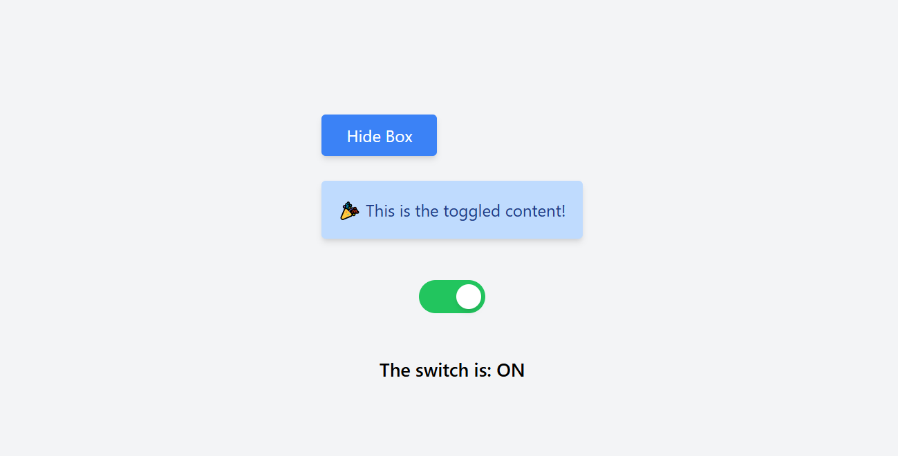

# Toggle-React-Toggle_Button_Ui

   
 


### Toggle code
```react.js

import React, { useState } from "react";

const DoggleApp = () => {
  const [isVisible, setIsVisible] = useState(false);
  const [isOn, setIsOn] = useState(false);

  return (
    <div className="flex flex-col items-center justify-center h-screen bg-gray-100 gap-10">
      {/* Show/Hide Toggle */}
      <div>
        <button
          className="bg-blue-500 text-white px-6 py-2 rounded shadow-md hover:bg-blue-600"
          onClick={() => setIsVisible(!isVisible)}
        >
          {isVisible ? "Hide Box" : "Show Box"}
        </button>

        {isVisible && (
          <div className="mt-6 bg-blue-200 text-blue-900 p-4 rounded shadow-md">
            🎉 This is the toggled content!
          </div>
        )}
      </div>

      {/* Switch Toggle */}
      <div
        className={`w-16 h-8 flex items-center rounded-full p-1 cursor-pointer ${
          isOn ? "bg-green-500" : "bg-gray-400"
        }`}
        onClick={() => setIsOn(!isOn)}
      >
        <div
          className={`w-6 h-6 bg-white rounded-full shadow-md transform ${
            isOn ? "translate-x-8" : "translate-x-0"
          }`}
        ></div>
      </div>
      <p className="text-lg font-semibold">
        The switch is: <span>{isOn ? "ON" : "OFF"}</span>
      </p>
    </div>
  );
};

export default DoggleApp;


```
